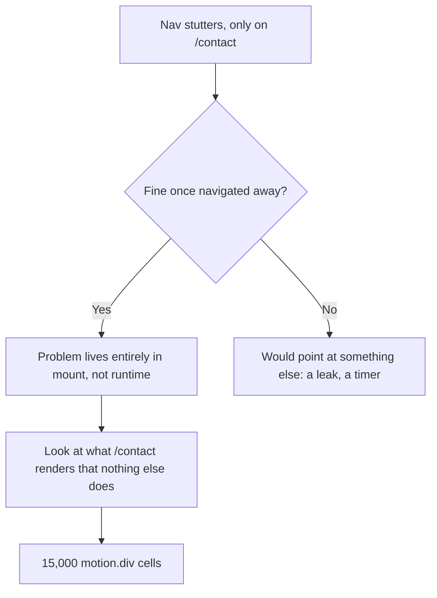

My own `/contact` page was quietly the slowest thing on my site, and the way it failed made no sense at first.

On my phone, opening that one page made the typewriter animation in the nav stutter and the mobile menu drag when it opened. Not the home page. Not projects. Only contact. And the instant I navigated away, everything went smooth again.

That specificity was the entire clue. Whatever was wrong lived entirely in that page's mount, and cleaned itself up completely on unmount.



## Finding the actual cost

A page that is slow while it appears and fine forever after is not telling you it has a runtime problem. It is telling you something was very expensive to build, once, and then cost nothing to keep.

So I opened the file to see what I had done. That is when I remembered I had not written it.

The Contact page renders a decorative background I had pasted in months earlier from a popular component library: a skewed grid of boxes that light up on hover. It looked like this:

```tsx
const rows = new Array(150).fill(1);
const cols = new Array(100).fill(1);

{
  rows.map((_, i) => (
    <motion.div key={i}>
      {cols.map((_, j) => (
        <motion.div
          key={j}
          whileHover={{
            backgroundColor: randomColor(),
            transition: { duration: 0 },
          }}
        />
      ))}
    </motion.div>
  ));
}
```

150 × 100 is 15,000 cells, and every one of them was a `motion.div`, not a plain `div`. That is the detail that matters. A `Motion` component is not just a DOM node. Per instance, it also:

- Creates `MotionValue` objects to track animatable properties outside React's normal render cycle
- Registers pointer-event listeners for `whileHover`
- Keeps its own style and ref bookkeeping so it can animate independently of re-renders

None of that is expensive once. It is expensive **fifteen thousand times, all at once, during mount**. That is exactly the main-thread spike that stalled my typewriter's `setState` and the menu's open transition while React was busy constructing the tree.

There were three things I missed the first time I looked at this.

First, the component is exported as `React.memo(BoxesCore)`. `memo` skips re-renders when props have not changed, and it does absolutely nothing for mount cost. That is the exact distinction this whole problem turns on: the standard performance primitive everyone reaches for first does not touch construction cost at all. 15,000 `Motion` instances get built once regardless of whether the component is memoized.

Second, the element count is actually much higher than 15,000. Every cell where `j % 2 === 0` and `i % 2 === 0` also renders an inline SVG with a `path`. That is roughly 3,750 more elements stacked on top of the 15,000 cell `motion.div`s and the 150 row `motion.div`s.

Third, unrelated to the cost but worth noting: the component imports from `motion/react`, as the library was recently renamed to `Motion`.

## The native CSS reality check

When you are staring at a massive grid doing simple hover states, you eventually have to ask: does this need `Motion` at all?

Generally speaking, swapping JavaScript animation wrappers for native CSS solutions is almost always better for performance. The visual effect here is just "cell changes color on hover, then fades back." CSS does that natively with `transition-property` and `:hover`. Replacing every `motion.div` with a plain `div` running CSS transitions would yield the exact same visual result with zero JavaScript cost per cell.

If you are optimizing for older laptops or slow networks, native CSS is definitively the right call. JavaScript animations run on the main thread. Forcing a constrained CPU to register 15,000 event listeners and calculate hover states in JavaScript will immediately choke the browser. CSS `:hover` states, on the other hand, are handled directly by the browser's internal engine, leaving the main thread completely free. Furthermore, on a slow network, relying on CSS means sending zero extra JavaScript over the wire, so users are not left waiting for a heavy animation library to download and parse.

But as much as I want to rewrite the desktop grid to use CSS natively, that was not the fire I needed to put out. Desktop browsers were chewing through the 15,000 components just fine. The crisis was on mobile, and mobile needed a different answer entirely.

## Mobile needed a different answer

Here is the detail that makes the whole thing almost funny: **touch devices do not have hover.**

Every phone visitor was paying a massive performance penalty to mount an interactive effect they could never actually trigger. So the right fix for mobile was not "make the grid lighter." It was "do not render the grid at all."

A `hidden md:flex` Tailwind class does not solve this because React still mounts every component underneath a `display: none`. The cost stays. The only way to actually skip the work is to not construct that part of the tree in the first place:

```tsx
const [isDesktop, setIsDesktop] = useState<boolean | null>(null);

useEffect(() => {
  const mq = window.matchMedia("(min-width: 768px)");
  const update = () => setIsDesktop(mq.matches);
  update();
  mq.addEventListener("change", update);
  return () => mq.removeEventListener("change", update);
}, []);

if (isDesktop === null) return null;
return isDesktop ? <HoverGrid /> : <MobileTexture />;
```

Now, mobile gets a lightweight, zero-element CSS noise texture instead. It is still decorative, but with nothing to mount.

## What actually shipped

|                      | Before                                         | After                                                 |
| -------------------- | ---------------------------------------------- | ----------------------------------------------------- |
| Desktop/tablet cells | 15,000 `motion.div`                            | 15,000 `motion.div`, unchanged                        |
| Mobile               | Same 15,000 `motion.div`, just visually hidden | Not mounted at all — CSS noise texture, zero elements |

The lesson here is about taking ownership of the code you ship. A component that looks flawless in an isolated library showcase can buckle in your layout. You cannot just drop ready-made components into your app without testing how they perform on mid-range phones, on touch devices, or on a rainy day when a user's network is struggling.

A performance bug that only shows up on one page, on one device class, is usually telling you exactly where to look. "It is slow while mounting, and fine once mounted" points at construction cost, and construction cost scales with _how many_ expensive things you are building, not how cheap each one looks in isolation.
