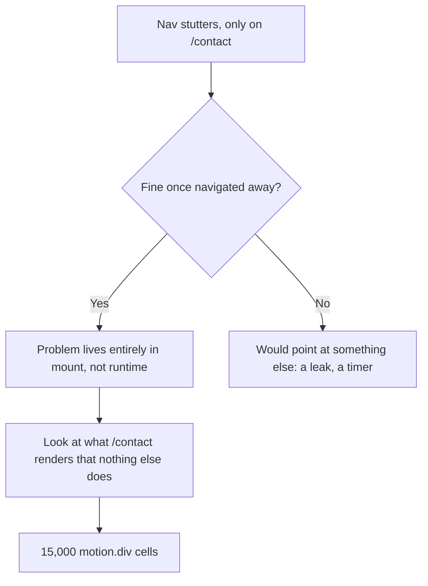

I noticed something specific: on my iPhone, opening the Contact page made the nav's typewriter animation stutter and the mobile menu slow to open, but only on that page, and only until I navigated away.

That specificity was the clue. Whatever was wrong lived entirely in that page's mount, and cleaned itself up completely on unmount.



## Finding the actual cost

The Contact page renders a decorative background: a skewed grid of boxes that light up on hover. It looked like this:

```tsx
const rows = new Array(150).fill(1);
const cols = new Array(100).fill(1);

{rows.map((_, i) => (
  <motion.div key={i}>
    {cols.map((_, j) => (
      <motion.div
        key={j}
        whileHover={{ backgroundColor: randomColor(), transition: { duration: 0 } }}
      />
    ))}
  </motion.div>
))}
```

150 × 100 is 15,000 cells, and every one of them was a `motion.div`, not a plain `div`. That's the detail that matters: a Motion component isn't just a DOM node. Per instance, it also:

- Creates `MotionValue` objects to track animatable properties outside React's normal render cycle
- Registers pointer-event listeners for `whileHover`
- Keeps its own style/ref bookkeeping so it can animate independently of re-renders

None of that is expensive once. It's expensive **fifteen thousand times, all at once, during mount**, which is exactly the main-thread spike that stalled the typewriter's `setState` and the menu's open transition while React was busy constructing the tree.

Three things I missed the first time I looked at this.

The component is exported as `React.memo(BoxesCore)`. `memo` skips re-renders when props haven't changed, and does nothing for mount cost. That's the exact distinction this whole problem turns on: the standard performance primitive everyone reaches for first doesn't touch construction cost at all. 15,000 Motion instances get built once regardless of whether the component is memoized.

The count is also higher than 15,000. Every cell where `j % 2 === 0` and `i % 2 === 0` also renders an inline SVG with a path, which is roughly 3,750 more elements on top of the 15,000 cell `motion.div`s and the 150 row `motion.div`s. I haven't gone back to count the exact total, so take that as approximate until I verify it.

One more thing, unrelated to the cost but worth noting: the component now imports from `motion/react` rather than `framer-motion`, since the library was renamed to Motion.

## The fix wasn't "fewer cells"

The first instinct is to just shrink the grid: 60×40 instead of 150×100. That helps, but it's treating the symptom. The actual question is: **does this need Motion at all?**

The whole visual effect is "cell changes color on hover, then fades back." CSS does that natively:

```css
.cell {
  transition-property: background-color;
  transition-duration: 1500ms;
}
.cell:hover {
  background-color: var(--hc);
  transition-duration: 0ms;
}
```

Swapping every `motion.div` for a plain `div` with this pattern keeps the exact same look (instant color-in on hover, slow fade-out) with zero JavaScript cost per cell. Motion was never buying anything here; it was just overhead.

## Mobile needed a different answer entirely

Here's the part that isn't obvious from profiling alone: **touch devices don't have hover.** A phone visitor can never see this effect, no matter how cheap each cell is made. So the right fix for mobile wasn't "make the grid lighter": it was "don't render the grid at all."

That's a real distinction. A `hidden md:flex` Tailwind class doesn't do this: React still mounts every component underneath a `display: none`, so the cost stays. The only way to actually skip the work is to not construct that part of the tree in the first place:

```tsx
const [isDesktop, setIsDesktop] = useState<boolean | null>(null);

useEffect(() => {
  const mq = window.matchMedia("(min-width: 768px)");
  const update = () => setIsDesktop(mq.matches);
  update();
  mq.addEventListener("change", update);
  return () => mq.removeEventListener("change", update);
}, []);

if (isDesktop === null) return null;
return isDesktop ? <HoverGrid /> : <MobileTexture />;
```

Mobile gets a lightweight, zero-element CSS texture instead: decorative, but with nothing to mount.

## What changed, concretely

| | Before | After |
|---|---|---|
| Desktop/tablet cells | 15,000 `motion.div` | 2,400 plain `div` + CSS hover |
| Mobile | Same 15,000 `motion.div`, just visually hidden | Not mounted at all |
| Hover behavior | Framer Motion `whileHover` | Native CSS `:hover` + `transition` |

The lesson that generalizes: a performance bug that only shows up on one page, on one device class, is usually telling you exactly where to look. "It's slow while mounting, and fine once mounted" points at construction cost, not runtime cost, and construction cost scales with *how many* expensive things you're building, not how cheap each one looks in isolation.
